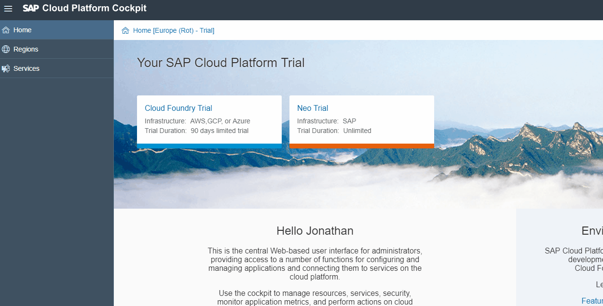
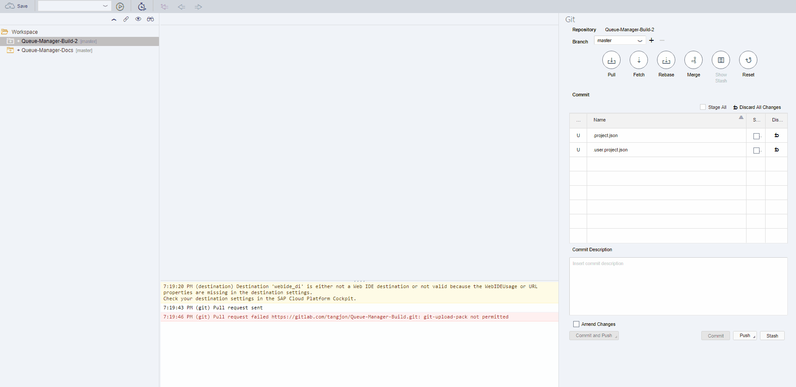

# How to restart the database
1. Open Firefox or a Vitrual Machine [**IMPORTANT STEP**] Won't be able to logon to correct acount without this step.
2. Go to (https://account.hanatrial.ondemand.com)
2. Login with user: ***p2000140239trial***. Find password on Microsoft Teams.
3. Click Neo Trial -> SAP HANA / SAP ASE Dropdown -> Databases and Schemas -> Click the 'qmdatabase'
-> Start

# How to Deploy Application
1. Go to (https://account.hanatrial.ondemand.com)
2. Applications Tab
3. HTML5 Applcations
4. Under actions. Edit application online using the SAP Web IDE
5. Hit cancel on everything until you reach a screen

