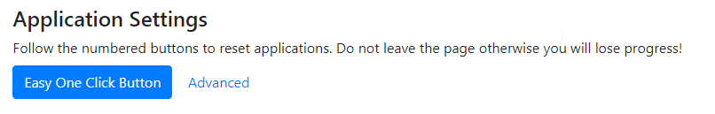
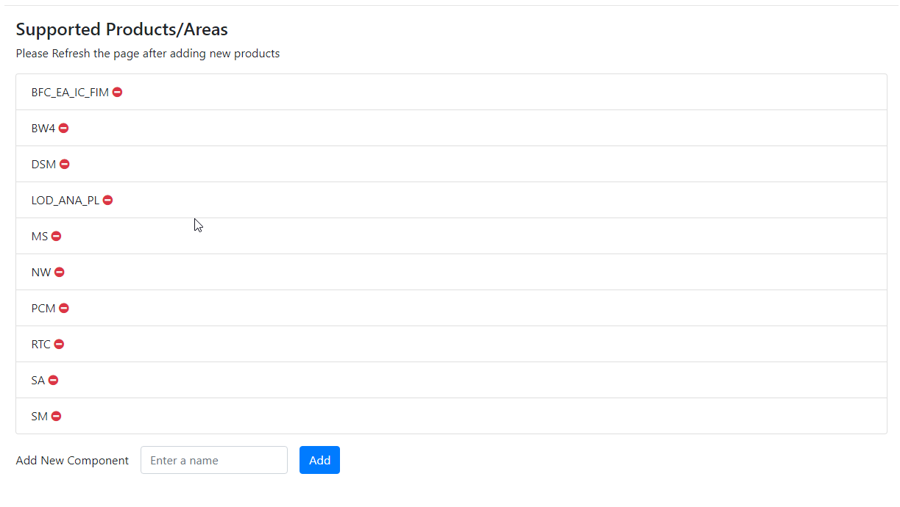

# Notice Board
Manage the real-time notice board that will be displayed through the application.
Toggle the noticeboard to display.


# Incident Number Overwrite
Ovewrite a users incident count.
```
**Example** Incident Type: NW | iNumber i123123 | Amount: 10
```


# Application Settings
| Buttons|Description| 
|:-------------: |-------------|
| Easy One Click Button | This will archive, reset queue days, reset incident count, and reset log entries|
| Advanced | Display single operations |
| Archive | Outputs all application data into JSON file |
| Reset Queue Days | Sets all queue days to zero |
| Reset Incidents | Sets all incident counts to zero |
| Reset Log Entries | Removes all log entries. Note: doing so may increase application performance |



# Add a Product Support Area / Component
View and manage available components / products supported. To add a component enter the name of the product.

To delete click the red '-' sign


