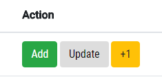
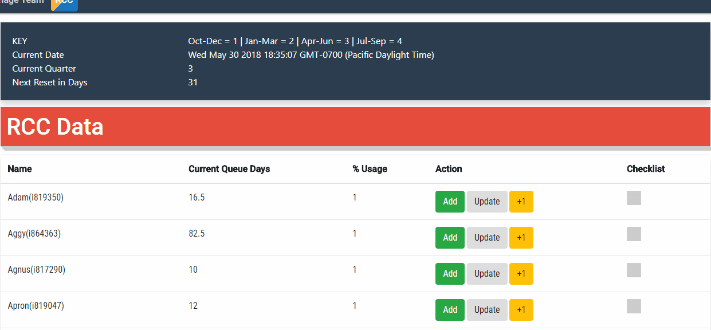
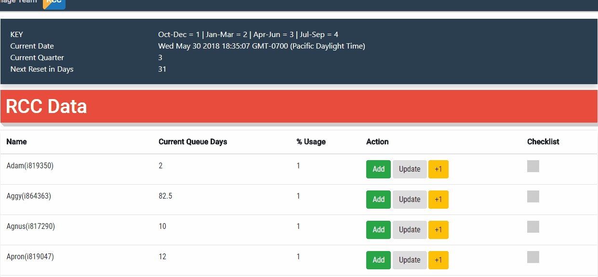

# Days Left in Quarter


| Variables     | Description
| ------------- | -------------|
| KEY      | The quarter of the year |
|  Current Date | The current date    |
| Current Quarter | See KEY definition      |
| Next Reset in Days   | The number of days left in the quarter. After quarter ends the tool should be reset     |

# Actions



## Add Queue Day
Click "Add" button to add to current queue day.
```
If current queue day is 25, adding 5 will become 30.
```


## Update Queue Day
Click "Update" to override the current queue day value.
```
If current is 25, updating will override to current queue days to 25
```


## Quick Add Queue Day
Click +1. This will quickly add 1 queue day to the user.

# Checklist
Simply for keeping track of whether the user's queue day has been updated. This check mark will not remain on the page
when refreshing or navigating away from the page
