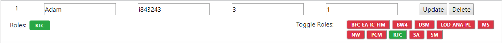
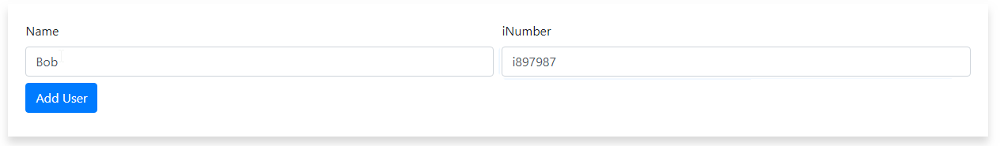

# Toggle Roles
Click component to enable role. This will determine who shows up through component navigator when assigning incidents.

RED : DISABLED

GREEN : ENABLED

# Change / Update User Meta Data
Click the component to add / remove user from component. 

| Variables     | Description
| ------------- | -------------|
| NAME      | The user's first name |
| I-NUMBER  | The user's I-Number      |
| Threshold | The user's maxiumum amount of incidents assignable per day      |
| % Usage   | The amount of time dedicated to incident handling per day. (0 to 1.0)      |

# Add New User
To add a new user give the user a name and a I-Number. Remember to assign the user roles. Otherwise they will not
show in the queue manager.

