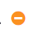
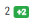

# Symbols and Icons
| Symbols|Description| 
|:-------------: |-------------|
|| User is available|
|| User is not available or offline|
|  | User has reached incident threshold|
|| User has been assigned 2 incidents today|

---

# Change QM
Change the QM with your I-Number to let other know you are QM.

---

# Change Components
Switch component views to see the available engineers that support it.

___

# Assign / Remove Incidents
Increment and decriment incident counts

___

# Toggle User
Switch user availability

___

